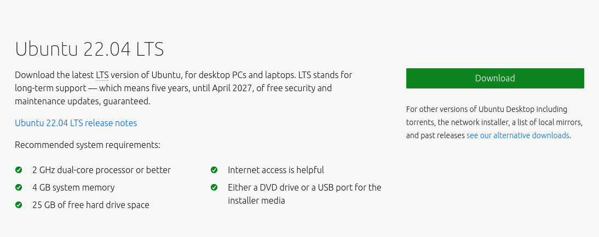
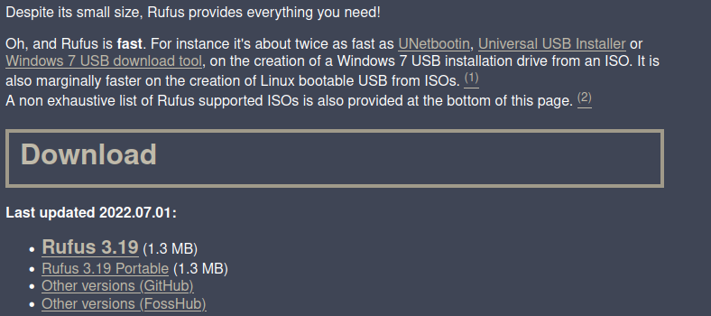
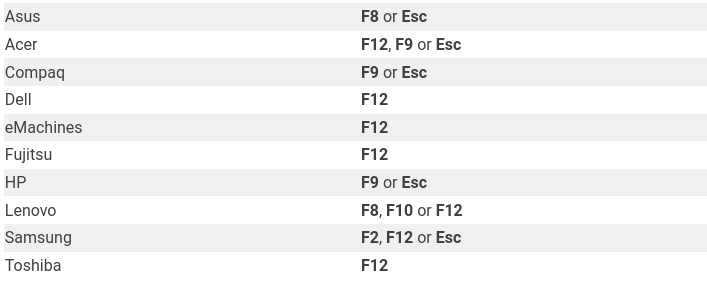
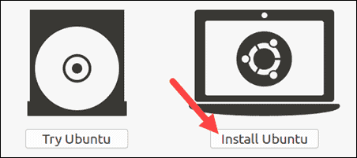
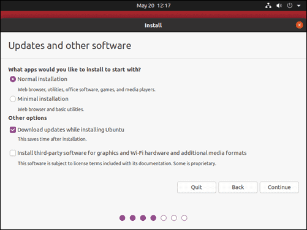
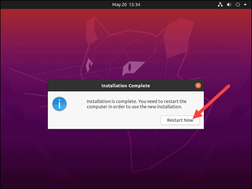

# Steps to install UBUNTU OS

This tutorial helps to install the new Ubuntu OS on your computer.

## Prerequisites

* `Minimum 2 GHz dual-core processor`
* `Minimum 4GB RAM`
* `Minimum 25GB free disk space`
* `One USB port`
* `Minimum 4GB USB drive`

## Step 1: Download the Ubuntu OS

* In a web browser, visit the [Ubuntu download page](https://ubuntu.com/download)
* Click the UBUNTU DESKTOP
* Check the recommended system requirements and click the download button

<figure markdown>
  { width="750" }
  <figcaption>Download Page</figcaption>
</figure>

* Download the .iso file in your desired local storage location

## Step 2: Creation of Bootable USB on Windows

* In a web browser, visit the [Rufus](https://rufus.ie/en/)
* Click the Rufus 3.19 (version may varies) under download section

<figure markdown>
  { width="750" }
  <figcaption>RUFUS Download Page</figcaption>
</figure>

* Double click and run the downloaded file
* Click "NO" for online update popup
* Rufus window appears in which select the downloaded .iso file
* Cross check the below configuration in your window

<figure markdown>
  { width="750" }
  <figcaption>RUFUS Window</figcaption>
</figure>

* Click start and wait for completion

## Step 3: Boot up Ubuntu from USB

* Turn off your system. Make sure you remove all other USB devices, such as printers, memory cards, etc.
* Insert the Ubuntu USB drive into the system and turn on your machine
* There are two possible scenarios
    1. The computer boots the USB drive automatically
    2. You need to manually configure USB booting in the Boot Menu or BIOS/UEFI.
* To manually configure the boot order, tap the boot menu key about once or twice per second as soon as the computer powers on
* The boot menu key may be different depending on your computer manufacturer. Below is a list of common boot keys associated to a brand

<figure markdown>
  { width="750" }
  <figcaption>Brand Boot Keys</figcaption>
</figure>

* Once you see your boot menu, use the arrows to pick the Ubuntu media to boot from. Your system should start loading the Ubuntu live disc menu

## Step 4: Install Ubuntu

* To begin the installation, click Install Ubuntu

<figure markdown>
  { width="750" }
  <figcaption>Install Ubuntu</figcaption>
</figure>

* choose keyboard preferred language and click continue
* Normal Installation – This is the full Ubuntu Desktop experience, with office software, games, and media players.
* Confirm - Download updates while installing Ubuntu – This does the work of downloading large package files during the installation. Once the installation finishes, the packages will be ready to apply as updates.
* Install third-party software for graphics and Wi-Fi hardware and additional media formats – Some hardware, like graphics cards and wi-fi cards, do not have open-source driver support. Also, some media formats, such as .wmv, do not fall under the GPL license. If you need support for these, you’ll need to agree to additional terms of use.

<figure markdown>
  { width="750" }
  <figcaption>Updated and other software</figcaption>
</figure>

* Next, you’ll be presented with an Installation Type dialog. You can wipe the hard drive clean prior to installing Ubuntu by clicking Erase disk and install Ubuntu.

* The next screen will allow you to create your own partition table and logical drives. This lets you divide a physical hard drive into different partitions. The operating system sees partitions as individual drives.

* Click Continue to apply your changes to the drive partitions.

* You’ll be asked to Write changes to disks?  None of the options you’ve selected are permanent until you click Continue on this screen.  Click Continue to proceed.

* Select Time Zone

* Once the system formats the disk partitions, the installer will ask Where are you?

* Type the nearest large city into the box, and the system will set your local time zone

* Click Continue

## Step 5: Create User Account

* Next, you’ll need to configure a user account. Fill in the following fields:

    `Name: Your actual name.`
    `Computer name: This is the hostname or network name.`
    `Username: The user account name you want to use.`
    `Password: Enter and confirm a strong password – the installer will automatically evaluate your password strength.`
    `Log in automatically: This is not recommended for publicly accessible servers.`
    `Require my password to log in: This is recommended for publicly accessible servers.`

* Click Continue to install Ubuntu.

* Once the installer finishes, remove the Ubuntu installation media. You’ll be prompted to Restart Now

<figure markdown>
  { width="750" }
  <figcaption>Ubuntu</figcaption>
</figure>

* The system should boot into your newly installed ubuntu OS