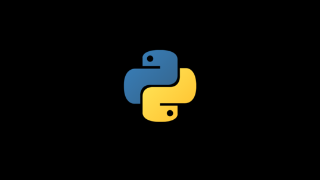
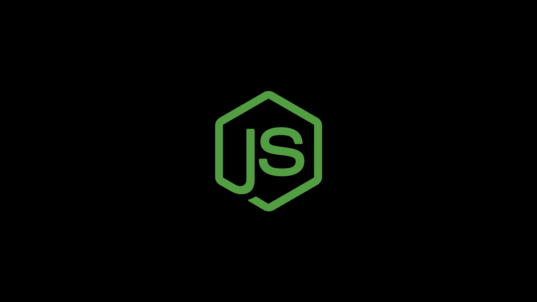
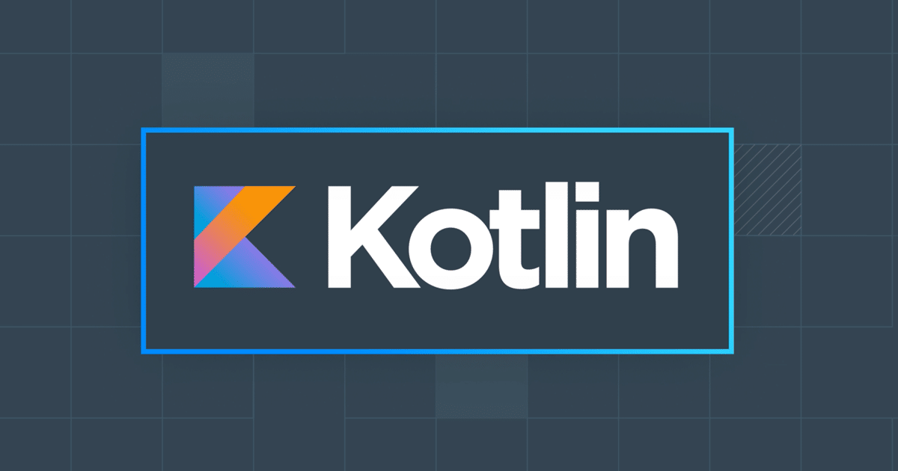
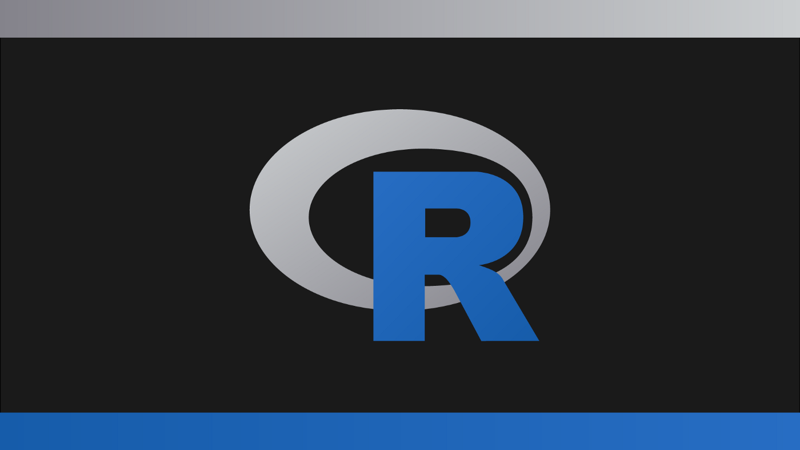
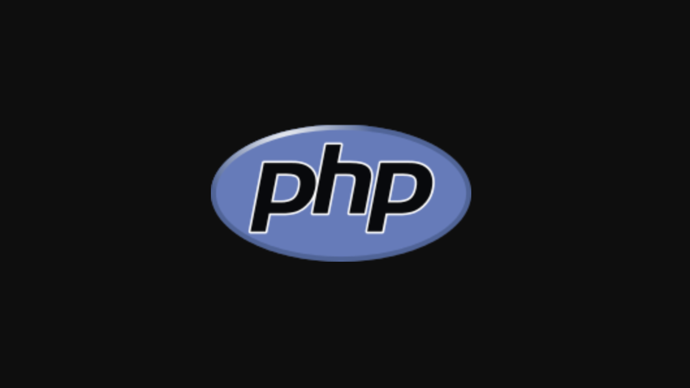

# Top 10 Programming languages to learn in 2022

Programming has become a very important skill for every programmer. There are lots of programming languages out there, each with its own unique features. Which one should you choose in 2022?

## 1. Python

Python is a programming language that has become very popular over the years. It is widely used in scientific research, data analysis and machine learning. What makes it so special?

Python was created by Guido van Rossum at AT&T Bell Laboratories in 1979. He wanted to create a simple scripting language that would be easy to read and write. The language was named after Monty Python Flying Circus because he thought it sounded cool. Since then, Python has grown into a powerful tool for programmers around the world.

<figure markdown>
  { width="750" }
  <figcaption>Python</figcaption>
</figure>

There are several reasons why Python is such a great programming language. For starters, it is open source, meaning anyone can access its code and improve upon it. Also, Python is free from licensing fees, allowing developers to focus on their projects without having to worry about paying royalties. Finally, Python is highly versatile and can be used for almost anything.

## 2. Java

Java is a programming language developed by Sun Microsystems. The language was initially released in 1995, and has since evolved into a robust and widely used software development tool.

Java is a general purpose object oriented programming language. It supports multiple programming paradigms such as procedural, functional, object-oriented, and imperative. As a result, Java is often used for web applications, desktop applications, mobile apps, server side scripting, embedded systems, game development, etc.

<figure markdown>
  { width="750" }
  <figcaption>Java</figcaption>
</figure>

Java is a powerful programming language that offers a wide range of features and tools. If you want to build a scalable application or create a secure system, then Java is the perfect choice.

## 3. Javascript

Javascript is a programming language that allows web developers to create interactive websites. What exactly is it?

Javascript is a scripting language that was developed by Netscape Communications Corporation (now part of Mozilla) in 1995. The name comes from JavaScript: The Language, which was released in 1994.

<figure markdown>
  { width="750" }
  <figcaption>Javascript</figcaption>
</figure>

Javascript is a powerful tool that has become essential to modern web development. It enables us to build dynamic websites, apps, and even games.

## 4. Kotlin

Kotlin is a programming language developed by JetBrains. It was created to provide Java developers with a modern, concise and type safe alternative to Java 8.

Kotlin is a statically typed programming language designed to be simple, powerful, and fun. It supports object orientation, functional programming, immutable data structures, coroutines, and much more.

<figure markdown>
  { width="750" }
  <figcaption>Kotlin</figcaption>
</figure>

Kotlin has become very popular over the last couple years.

## 5. R

The R Programming Language (RPL) is a free software environment and programming language developed by Ross Ihaka and Robert Gentleman at the University of Auckland. It was originally designed for statistical computing, but has since become widely used in other fields such as machine learning, data science, bioinformatics, computational biology, and visualization.

<figure markdown>
  { width="750" }
  <figcaption>R Language</figcaption>
</figure>

RPL is a general purpose programming language that supports procedural, object oriented, functional, and imperative programming styles. It also provides a wide range of tools for data analysis and graphics.

## 6. GO

Go is a new programming language developed by Google. It was designed to be simple, safe, reliable, efficient, and productive. It has a clean syntax and powerful features.

<figure markdown>
  { width="750" }
  <figcaption>Go</figcaption>
</figure>

Go is a modern programming language that combines simplicity, safety, reliability, efficiency, and productivity. It also supports concurrency, interfaces, generics, and reflection.

## 7. PHP

PHP is a widely used open source scripting language designed for web development. What makes it special?

PHP was originally developed by Rasmus Lerdorf at the University of California, Berkeley. He released it under the GNU General Public License (GPL) in 1995. The name stands for Hypertext Preprocessor. PHP has become the most commonly used server side programming language in the world.

<figure markdown>
  { width="750" }
  <figcaption>PHP</figcaption>
</figure>

PHP is a powerful tool for web developers who want to create dynamic websites. It offers features such as object oriented programming, database connectivity, and support for XML and HTML.

## 8. C Sharp

C Sharp is a general purpose programming language developed by Microsoft. It was designed to be simple, object oriented, and high performance. It has become one of the most widely used languages for developing applications.

C Sharp is a modern programming language that supports object-oriented programming (OOP) and class-based inheritance. The syntax of C Sharp is similar to Java, except that it uses curly braces instead of square brackets.

<figure markdown>
  { width="750" }
  <figcaption>C#</figcaption>
</figure>

C Sharp is a very powerful programming language. It provides features such as strong typing, exception handling, reflection, LINQ, generics, anonymous types, lambda expressions, etc. These features enable developers to write code faster and more efficiently.

## 9. Swift

Swift is a new programming language developed by Apple Inc. The company has released its first public beta version of Swift 2.0. What does it mean for developers?

Swift was announced at WWDC 2016, where Tim Cook said that they had spent years working on the language. They wanted to create a modern programming language that would allow them to build apps faster.
 
<figure markdown>
  { width="750" }
  <figcaption>Shift</figcaption>
</figure>

Swift is designed to be simple, safe, and powerful. It uses features from C, Objective-C, and Java, but also adds some unique features. For example, it supports automatic memory management, generics, and closures.

## 10. Ruby

What is Ruby? Is it a language or a framework? What does it mean to program in Ruby?
 Ruby is a dynamic object-oriented scripting language developed by Yukihiro Matsumoto.

It was originally designed for writing web applications, but has since grown into a full-fledged general purpose programming language.

<figure markdown>
  { width="750" }
  <figcaption>Ruby</figcaption>
</figure>

Ruby is a high level, dynamic, object oriented, reflective, interpreted, and dynamic programming language. It is also known as 'the little sister' of Perl.